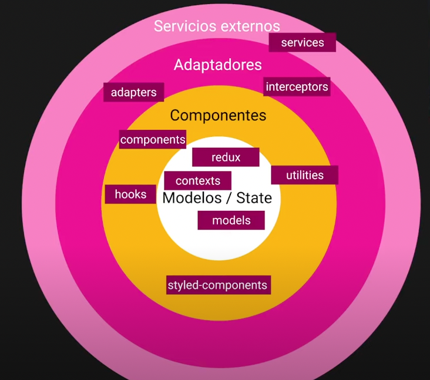
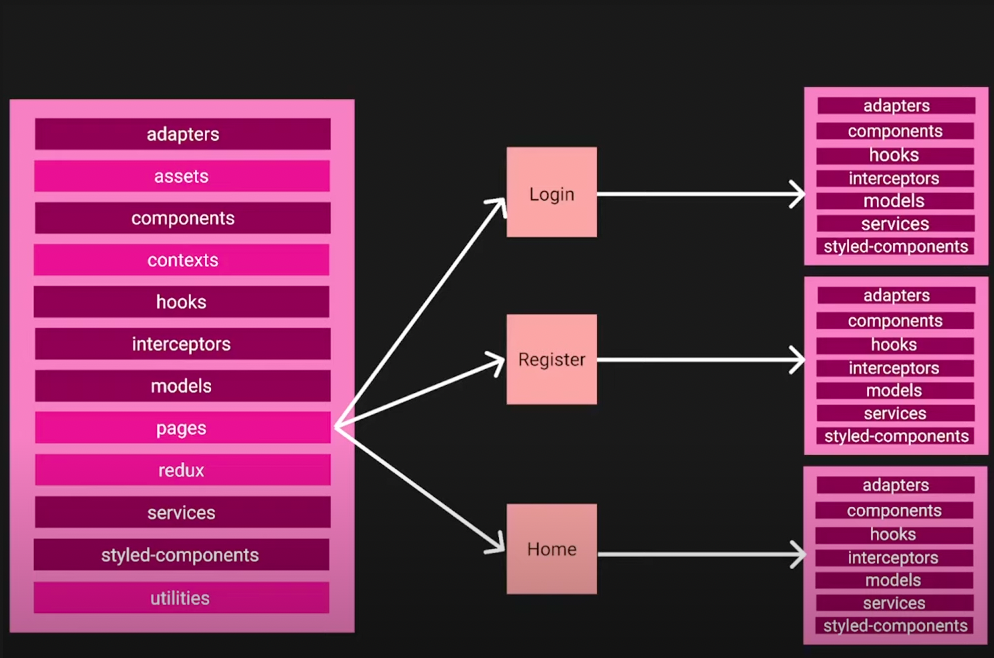

# Clean Structure React

## Folders

En el root/src de nuestro proyecto encontraremos todas estas carpetas (entre otras):

- `adapters`: elementos que reciben información, la adaptar y retornan
- assets
- `components`
- contexts
- `hooks`
- `interceptors`: modifican las llamdas y respuestas sobre una API
- `models`: representación de las entidades
- pages: vistas del proyecto
- redux: librería de estado
- `services`: llamadas a una API
- `styled-components`: librería de componentes de estilos
- utilities

Las carpetas `destacadas` tienen a ser **reutilizables**.



`Modularización`: división del proyecto de manera que cada módulo de nuestro proyecto sea independiente. Concepto fundamental para aplicar el `lazy-loading` (carga de componentes o parte de los mismos sólo cuando son necesarios).

Dentro de una pages es posible encontrar esta misma división de carpetas. De esta manera un adapter con un flujo de vída único para el login se encuentra en la misma carpeta mientras que el resto de adaptarse compartidos por todo el proyecto pertenecen a la carpeta adapter del root. Así evitamos sobrecargar de métodos las carpetas que se encuentras en el src y ganamos optimización de recursos a la hora de ejecutar y compilar nuestro código (lazy-loading: lo que no se usa, no se carga).



## Adapters

Centralizamos la transformación de recursos y la retornamos para su empleo en múltiples partes de nuestro proyecto. Si la información servida por una API, por ejemplo, cambiara el día de mañana nosotros únicamente modificaríamos esta sección del código y la aplicación seguiría funcionando correctamente.

```ts
import { EndpointUser, User } from '@/models';
export const createAddapterdUser = (user: EndpointUser) => {
	const formattedUser: User = {
		name: user.name,
		lastName: user.last_name,
	};
	return formattedUser;
};
```

## Assets

Contenido multimedia de nuestra página: imágenes, logos, vídeos, audios, gifs...

## Components

En esta carpeta almancemanos componentes que emplearemos a lo largo de toda la aplicación

```tsx
import React from 'react';

export const Button = () => {
	console.log('my first component');
	return (
		<div>
			<h1>Hello world!</h1>
		</div>
	);
};
```

## Contexts

Entidades que emplearemos a lo largo de toda la aplicaicón. El context nos permite manejar el estado de nuestra aplicación. Una recomendación de empleo de contexts iría dirigido a información de una sola vista o información muy muy simple. A diferencia de REDUX, dónde almacenaremos información general de toda la aplicación (como por ejemplo, el current user).

Estos contextos deberán ir dentro de la page de referencia. Si poseen información general de la aplicación, deberemos emplezarla en el root.

## Hooks

Los customs hooks son una forma de controlar los ciclos de vida de un componente. Muchos de estos ciclos de vida se reutilizarán a lo largo de todo nuestro proyecto por lo que es recomendable exportar esta lógica.

## Interceptors

Ejecutan una petición y si, por ejemplo, en la cabecera de una petición no se encuentra el token del user devolverán un error 500.

## Models

Elemento clave para la representación de entidades en typescripts.

```ts
export interface SelectOption {
	lable: string;
	value: string;
}

export interface Action<T> {
	type: string;
	payload: T;
}
```

## Pages

Cada una de las vistas de nuestro proyecto.

## Redux

```ts
import { createStore } from 'redux';

const initState = {};

const routReducer = (state = initState, action: any) => {
	console.log(state);
	console.log(action);
	return state;
};
// crear el store y luego proveememos con un componente el store que emplearemos en toda la app.
export const store = createStore(routReducer);
```

## Servicios

Llamadas a las APIs.

## Styled-components

```tsx
import React from 'react';
import styled from 'styled-components';

const ItemWrap = styled.div`
	padding: 5px;
	border: 1px solid red;
	margin: 5px;
	display: flex;
	justify-content: space-between;
`;
```

## Utilities

Funcionalidades que de manera descontextualizada pueden ser integradas en nuestro código.

```ts
export const FormatDateMMMD = (dateString: string): string => {
	const date = new Date(dateString);
	return `${date.toLocalDateString('en-usa', { month: 'short' })} ${
		date - getDate()
	}`;
};
```
